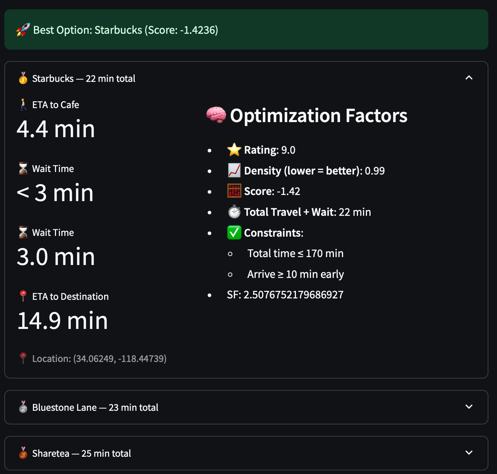
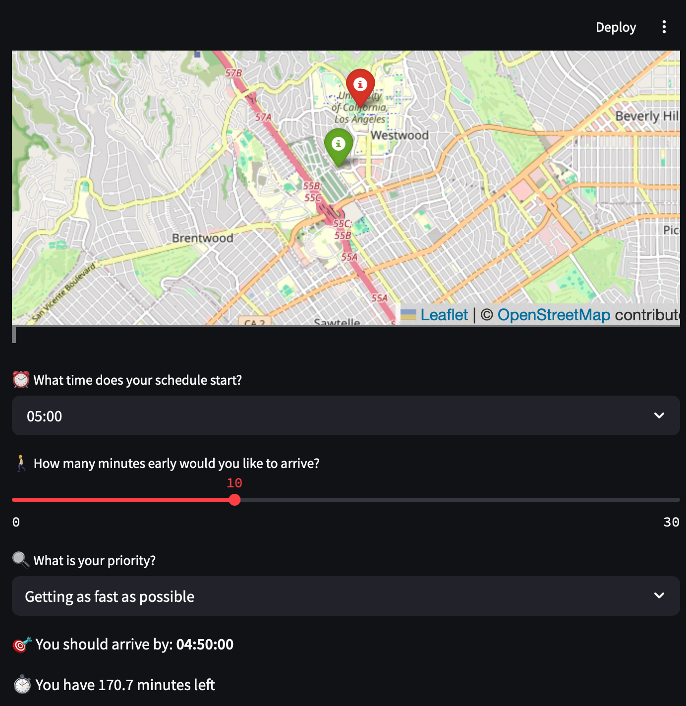
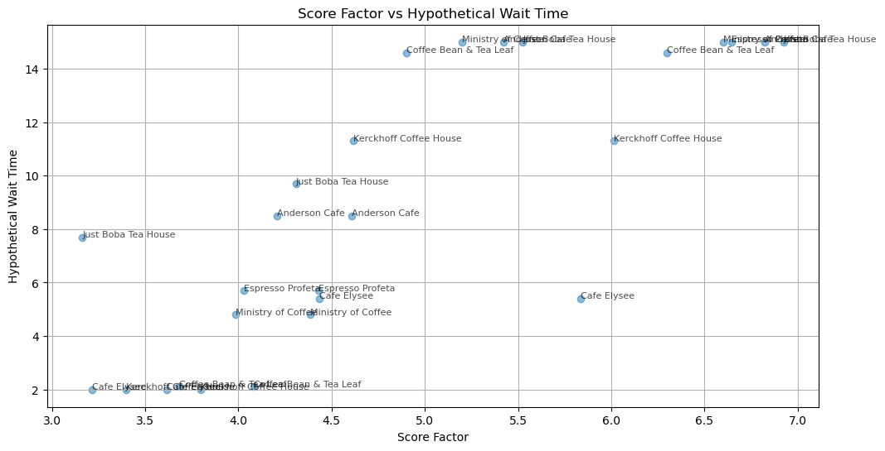
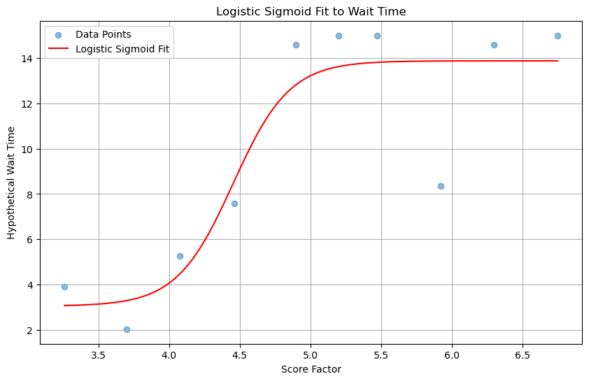
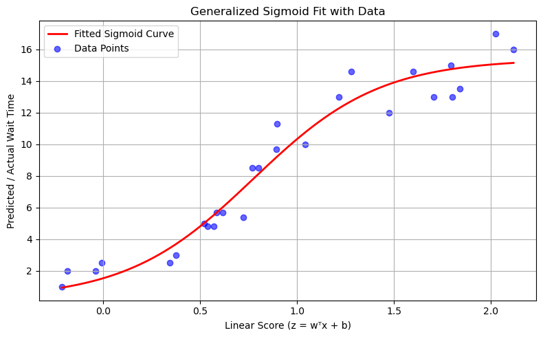

# ☕️get-your-coffee
# Don't be late for coffee
🔗Link: https://getyoucoffee.streamlit.app


# Motivation

Have you ever experienced ordering coffee nearby your school or office and being late for meeting / class because of long waiting time to get coffee?



***<u>Optimal route or ETA does not necessarily means you will get your coffee early</u>*** - it's not easy to know which coffee shop is crowded right now! You may not want to take a long detour, or go to your least favorite place to just get coffee as quickly as possible.

**get-your-coffee is a project to give you real-time suggestion for best coffee place you can get, in which**

*  You won't be late for your meeting / class / appointment, ***not only considering travel time but also waiting time for coffee.***
* As long as you can make it to the target time (including some buffer to prepare for your class for meeting), it will get you the best place!

# Package requirements

## 📦 Project Requirements

| Category                           | Name                  | Purpose / Role                                               | Installation Command                                      |
| ---------------------------------- | --------------------- | ------------------------------------------------------------ | --------------------------------------------------------- |
| Core App                           | `streamlit`           | Build interactive web UI and handle user inputs              | `pip install streamlit`                                   |
| Linear Programing for Optimization | `Gurobi`              | Linear Proframming for optimizing based on constraints & objective function | Requires License                                          |
| Geocoding                          | `geopy`               | Convert location queries into coordinates using Nominatim geocoder | `pip install geopy`                                       |
| Map Rendering                      | `folium`              | Display maps and markers for start/destination locations     | `pip install folium`                                      |
| Streamlit Map                      | `streamlit-folium`    | Embed Folium maps directly within the Streamlit app          | `pip install streamlit-folium`                            |
| HTTP Requests                      | `requests`            | Call external APIs (e.g., Foursquare) to retrieve place information | `pip install requests`                                    |
| External API                       | Foursquare Places API | Retrieve real-time info (rating, popularity, density) for wait time estimation | [Foursquare Developer](https://developer.foursquare.com/) |

---

### 📝 Notes

- You must create a Foursquare developer account and generate an **API Key** to access place data.
- You need to set up for **Gurobi with your own license.**
- The app is tested with **Python 3.8+**.
- To install all packages at once, you can create a `requirements.txt` file:

```txt
streamlit
geopy
folium
streamlit-folium
requests
```

## User input 

This app takes the following from UI as an input:

* **Departing location and destination** : 
  * When you input location name as string (e.g. UCLA campus), you can search places using [**Nominatim API**](https://nominatim.org) 
* **Schedule starting time** : When does your next schedule on destination start?
* **Buffer time :** Time you want to have a gap before starting time. Hard deadline for arrival will be schedule starting time - buffer time.  
* **Priority:**
  * Time: It will optimize based on minimum total spent time.
  * Rating: ***As long as you can get to destination before hard deadline***, it will also consider rating as one of the important features. 
  * Less crowded:  ***As long as you can get to destination before hard deadline***, it will consider 'low densityt' as one of the import features. 



# Notes on models and methodology

## 1. Linear Programming

This app utilizes **Linear Programming (LP)** to determine the optimal coffee shop that minimizes the total time spent before arriving at the final destination.

The optimization model is designed to choose **one coffee shop** from a set of candidates that minimizes the total time and inconvenience, while respecting arrival constraints and user preferences.

### 🧮 Variables

Let:

- $\( x_i \in \{0, 1\} \)$: Binary decision variable indicating whether cafe \( i \) is selected (1) or not (0)

### 📌 Constraints

- **Only one coffee shop can be selected**: $\sum_{i=1}^{n} x_i = 1$
- **Feasibility filter**: Only cafes that satisfy the following conditions are considered:
  - Total time from start → cafe → wait → destination ≤ `max_total_time`
  - ETA from cafe to destination ≥ `min_arrival_gap`

### 🎯 Objective Function

The model maximizes a **custom utility score** that balances multiple factors such as:

- ⭐️ Rating (higher is better)
- ⏱️ Wait time (lower is better)
- 🚶‍♂️ ETA from start to cafe and from cafe to destination (lower is better)
- 🧑‍🤝‍🧑 Density or crowdedness (lower is better)

For each cafe \( i \), the utility score \( S_i \) is calculated as:
$S_i = w_r \cdot \frac{\text{rating}_i}{5} - w_w \cdot \frac{\text{wait}_i}{20} -w_d \cdot \frac{\text{eta}_{\text{cafe to dest},i}}{20} - w_s \cdot \frac{\text{eta}_{\text{start to cafe},i}}{20} - w_c \cdot \text{density}_i$

Where:
- $w_r$: Weight for rating
- $w_w$: Weight for wait time
- $w_d$: Weight for ETA to destination
- $w_s$: Weight for ETA from start
- $w_c$: Weight for density

These weights vary depending on the selected user **priority_option**.

The objective is: $\max \sum_{i=1}^{n} x_i \cdot S_i$

### 🧠 Solver

This problem is solved using the **Gurobi Optimizer** with binary decision variables, and the top-ranked cafe is chosen based on the highest score under constraints.

## 2. Initial Modeling for Coffee Wait time with small amount of data

With limited access to real-time wait time data, this project proposes some complementary approaches to **estimate coffee shop wait time** using public metadata from APIs (e.g., Foursquare rating, density, popularity). Both methods are built on simple assumptions to provide a fast, lightweight, and interpretable estimation.

### 1. Probabilitstic baseline heuristic model 

This model is based on the following assumptions:

1. The wait time at a coffee shop **typically does not deviate significantly from the average**.
2. The average wait time is primarily influenced by:
   - Higher crowd density → longer wait times.
   - Time-of-day (e.g., lunch hours) → higher baseline congestion levels.
3. The following factors introduce **uncertainty**, contributing to greater variance around the mean:
   - Higher rating → shorter wait times.
   - A larger number of reviews (log-transformed) → suggests higher traffic, potentially leading to longer wait times.

The model pre-defines a baseline wait time for each time slot and dynamically adjusts the **mean (μ)** and **standard deviation (σ)** of the wait time for each coffee shop based on its metadata. A **truncated normal distribution** is then used to sample from a bounded range of plausible values.

#### ⏱️ Wait Time Sampling Formula:
$$
\text{WaitTime} \sim \text{TruncatedNormal}(\mu, \sigma, \text{min}=1, \text{max}=20)
$$

Where:

- $\mu = \text{Baseline}_{\text{slot}} + w_r \cdot (\text{rating} - 4) + w_l \cdot \log(1 + \text{reviews}) + w_d \cdot \text{density}$
- $\sigma = \text{base\_std} + p_r \cdot (5 - \text{rating}) + \frac{p_l}{\log(1 + \text{reviews}) + \epsilon}$

**Parameters:**

- `Baseline_slot`: predefined mean wait time for each time slot (e.g., lunch = 10 min)
- `w_r`, `w_l`, `w_d`: weights for rating, log-reviews, and density (mean influence)
- `p_r`, `p_l`: penalties to increase standard deviation for uncertainty
- $\epsilon$: small constant to avoid division by zero

This approach allows the model to simulate realistic and variable wait times for each coffee shop even with limited data.

### 2. Sigmoid curve fitting based on heuristic data

This approach uses a **sigmoid (S-shaped) function** to map a composite delay score into an estimated wait time. The model assumes that coffee wait times do not increase linearly with crowding or time proximity, but instead follow a **non-linear, saturation-prone pattern**, which is well-suited for sigmoid modeling.





#### 🧩 Process

1. A small dataset of wait times was constructed through manual review of publicly available data sources such as:
   - Google Maps reviews
   - Reddit forums
   - Blog articles on cafe congestion
2. Based on metadata (e.g., rating, density, proximity to peak time), a composite **delay score** is computed.
3. A **logistic sigmoid function** is then fitted to map this score to realistic wait times.

#### 📈 Why Sigmoid?

Coffee wait times often exhibit characteristics like:

- Slow increase in low-traffic conditions,
- Sudden surge as it nears peak hours (e.g., lunch time),
- Saturation and flattening as the system reaches its capacity.

These are signature traits of an **S-shaped response curve**, where a small increase in input (e.g., crowd density or proximity to noon) can cause a **rapid jump in wait time** near the inflection point, but show limited change before/after that.

$\text{WaitTime}(x) = \frac{L}{1 + e^{-k(x - x_0)}} + \text{offset}$

Where:
- $x$: composite delay score
- $L$: maximum contribution of congestion to wait time
- $k$: steepness of the curve
- $x_0$: score value at the inflection point
- $\text{offset}$: minimum base wait time

### Note: Inspired by Adburg Method

This approach is inspired by the [**Adburg Method**]()used in behavioral modeling and low-variance human response systems. The Adburg principle assumes:

- **Stable functional patterns** of response to increasing stimuli,
- Low individual variability when system structure is known,
- Fittable with a small, well-designed dataset.

Similarly, **coffee wait time patterns are highly structured** (e.g., dominated by lunch rush, store capacity, service cycle), making them ideal for heuristic sigmoid fitting with **low variability** and **high interpretability**.

#### 🧪 'Coffee wait time delay' Score Design

The score \( x \) is calculated by aggregating:

The score \( x \) is calculated by aggregating:

$x = \alpha_1 \cdot \tilde{D} + \alpha_2 \cdot \tilde{P} + \alpha_3 \cdot \frac{1}{R} + \alpha_4 \cdot \frac{B}{10}$

Where:

- $\tilde{D}$: **Stretched Density**
- $\tilde{P}$: **Sigmoid-transformed Proximity to Peak Time**
- $R$: **Rating**
- $B$: **Baseline wait time** for the current time slot (e.g., lunch, afternoon)
- $\alpha_1, \alpha_2, \alpha_3, \alpha_4$: weights set heuristically

# Final selection of model: Generalized Sigmoid (Single Neural Network) Fitting.

The problam of using creating scoring logic, and fitting with Sigmoid function was that, low & high end in terms of the score were too flat, resulting in no difference in wait time even when score difference are non-negligible. This could have been caused by too general, or simple hand-crafted rule to generate score, less likely to capture patterns with more robustness. 

Initially introduced method defines raw feature to 'score' transformation with hard-coded rule, and fits Sigmoid function by taking this 'score'. However, if we use the single neurat network with sigmoid function, we can find out the best function which transforms raw data to input of sigmoid, which could be interpreted as the 'score'. 



1. Linear transformation: 
   $$z = \mathbf{w}^\top \mathbf{x} + b$$

2. Generalized sigmoid output: 
   $$\hat{y} = \frac{L}{1 + \exp\left( -k (z - x_0) \right)} + \text{offset}$$

Where:  
- $$\mathbf{w} \in \mathbb{R}^n$$ (learnable weights)  
- $$b \in \mathbb{R}$$ (bias)  
- $$L, k, x_0, \text{offset} \in \mathbb{R}$$ (learnable sigmoid parameters)  
- $$\hat{y} \in \mathbb{R}$$ (predicted wait time)
